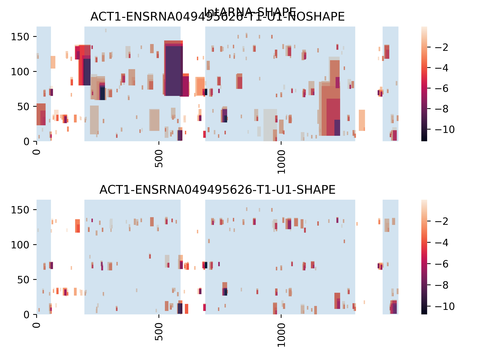
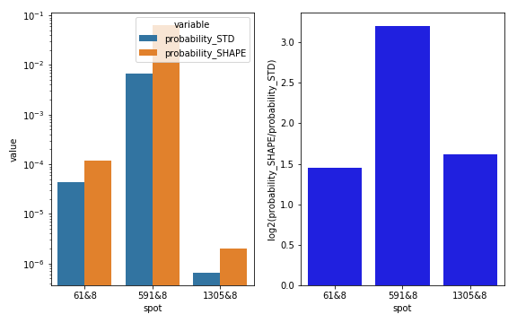
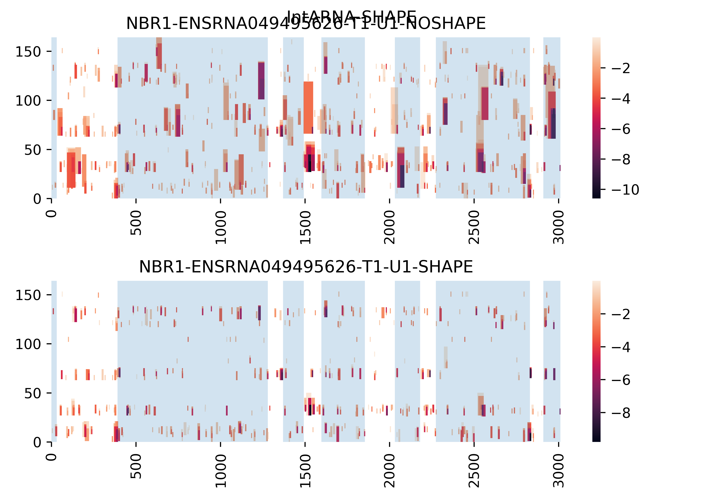
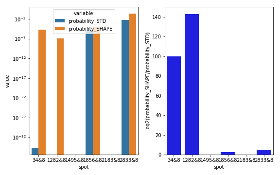
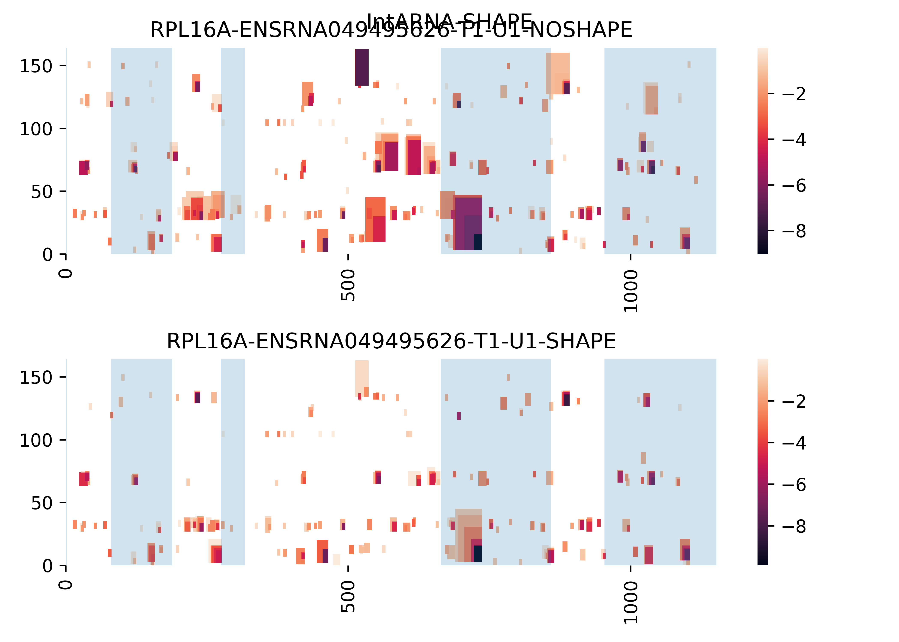
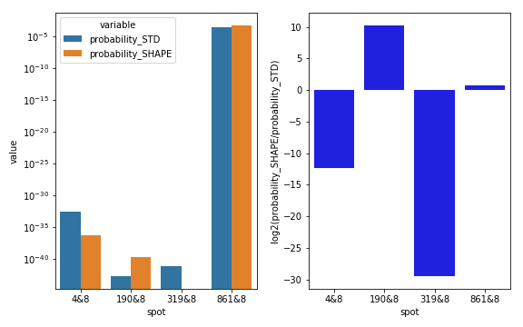
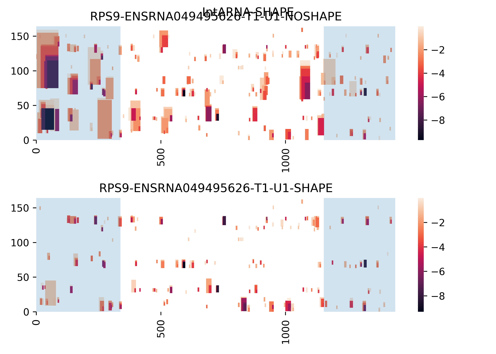
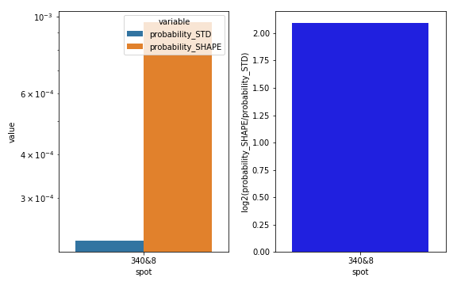
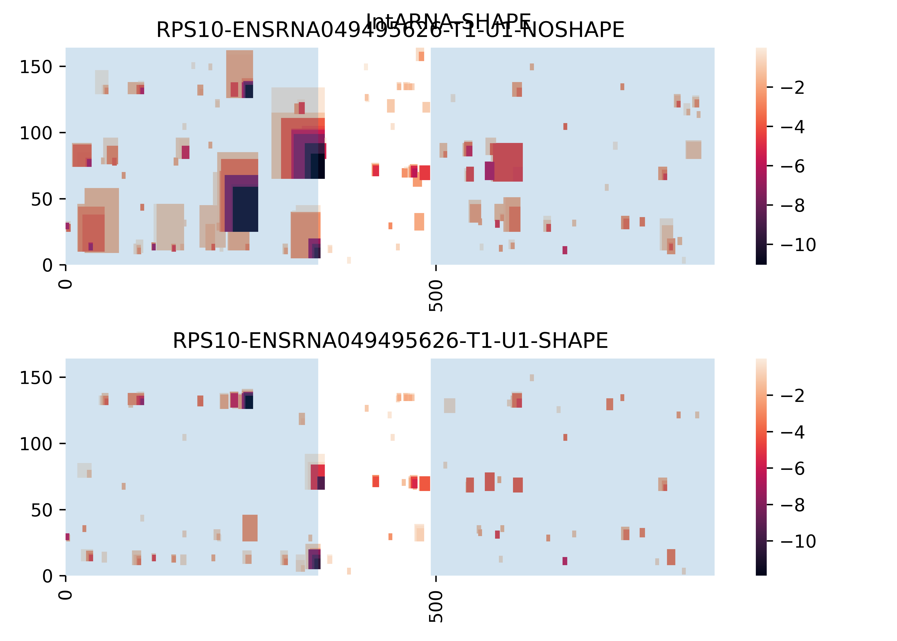
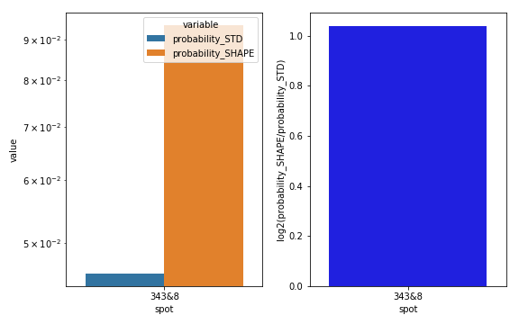

# Benchmarking IntaRNA's extension for structure probing (SHAPE) data

This repository contains data and analysis scripts for IntaRNA-SHAPE project and publication.

In the following, we provide IntaRNA interaction heatmap representations as well as interaction site probabilities for target pre-mRNAs of the splicosomal U1 RNA. 

Within the heatmaps, exons are highlighted with gray background while introns are given in white. Predicted interaction sites are drawn in colored boxes where darker boxes relate to lower energy (more stable and probable) interactions. The x-axis corresponds to pre-mRNA indices while the y-axis represents positions of U1. For the latter, the U1 recognition site for intronic 5' splice sites is at position 3-10. Thus, interactions of that site correspond to the bottom of the graph. The top graph represents interaction sites without SHAPE constraints while the bottom graph depicts the altered prediction when U1 SHAPE constraints are considered within IntaRNA's accessibility computation. 

The left barplot shows the predicted interaction probabilities of all intronic 5' splice sites with the recognition site of U1 (called a *spot*). Blue bars represent the unconstrained probabilities while orange bars depict the probabilities when U1 SHAPE constraints are used.
The right bar plot provides the ratio of both probabilities for each interaction site (spot).

For further details, please refer to the manuscript.

## ACT1

## NBR1

## RPL16A

## RPS9

## RPS10

